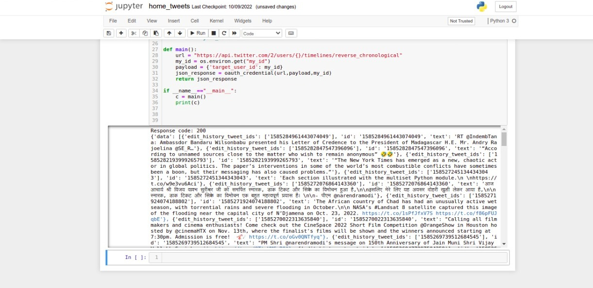

# Twitter_bot

## Description
This project is created for a very meaningful purpose. It is very difficult for any user. Who is very busy in his life and doesn’t have much time to engage with people on Twitter. It is also difficult to follow back all his followers if there are 10k followers. Then it will take a few hours to respond to each of them. And it is also not possible to just leave them without any response. Because it is also important for him to keep connected with his social life. To solve that problem of users. This type of project come into the picture. Here you are looking at a Twitter bot. Which will perform some very important tasks. These are the following task this twitter does on the behalf of a user and saves his time:-
1. Follow back to all the Twitter accounts. Which follows our user’s Twitter account. 
1.  It replies to the tweets in which our user is mentioned and tweets contain words like “Help” or “Support”.
1. Retweet all the favorite tweets from users' timelines. Which fall into a particular criterion.
## What is a bot ? 
A bot is used as a short form for the robot. A bot is a computer program that saves human effort and does the task with the same accuracy, without getting tired. There are the following advantages of a bot:- It automates a task and saves a lot of time. Great accuracy is achieved. Lots of resources were saved. Lots of money saved. No need for human interaction. And a lot of work a bot can do for a human. 

## Aim of this project
The main aim of this project is to save the time of the user. Automate some important tasks eg:- liking a favorite tweet, retweeting a tweet, follow back followers.

## Technology and modules used
In this project, we have used some very latest and new technologies for our project. Some of these technologies are:-
1. dotenv
1. requests
1. os
1. json
1. requests_oauthlib

You need these modules and technologies in your system to run this project. We have put all these modules/technology in requirements.txt

## How to run this project
1) you need to clone this repository in your repository.
> git clone https://github.com/vishu1994/Twitter-bot.git  

2) After that  run a command on  your terminal 
> pip install -r requirements.txt

 this will donwnload all the requirements to run this project in you system.  

3) After that open your terminal and run the different-different python files
> python filename 

4) To make this project automated install cron jobs in your system. Then in the terminal run this code
> crontab -e  

5) Now press i. You will be enter in insert mode then type

> \* \* \* \* \* /path/to/python3python_file>>/log_file/where/you_want_to/log_output/of_crontab 2>&1

2>&1 shows all errors and output are logged in the same file.
1. first * shows that minutes of hours 0-59 min.
1. Second * shows that hours of day 0-23 hr.
1. Third * shows date of months 0-31 date.
1. Forth * shows month of year 1-12 months.
1. Fifty * shows the day of week 0-6.

## Output

